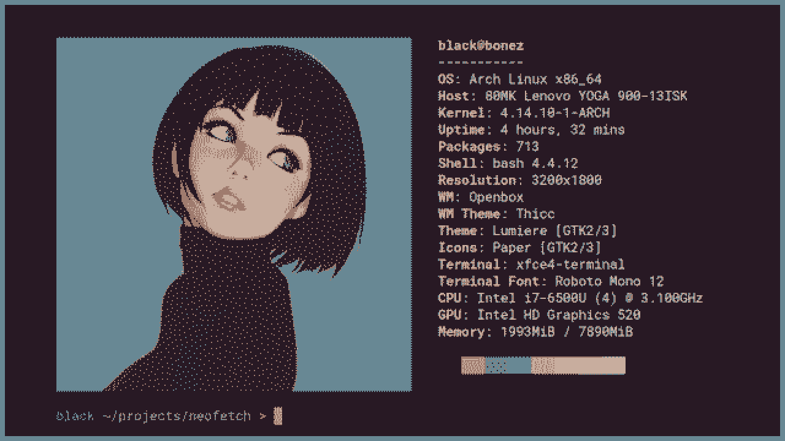

  

  <h1>Unix configuration</h1>
  
A script that sets my configuration on unix systems.

## Made:

- **Of:**
    - [**Shell script**](https://Depedencies)**:** A computer program designed to be run by the Unix shell
    - [**Make**](https://Depedencies)**:** A build automation tool to builds executable programs
- **With:**
    - [**Love**](https://rebrand.ly/r1ckr0l13r)**:** A secret ingredient that I put in every project
- **For:**
    - [**Me**](https://github.com/serapagranchose)**:** A developper who likes to learn by making

## Contains:

- **Binaries:**
    - **Discord CSS generator:** A shell script that changes the color of the Discord theme according to the current wallpaper
    - **Random wallpaper:** A shell script that changes the wallpaper to an animated randomized one and changes the system-wide color theme according to the current wallpaper
- **Dotfiles**
- **Packages**

## To do:

- **New features:**
    - [ ] Adding hard links to dotfiles
    - [ ] Adding more dotfiles
    - [ ] Documenting each dotfiles to README.md
    - [ ] Documenting each packages to README.md
    - [ ] Pulling and compiling binaries from Github
    - [ ] Adding binaries Github URL links to README.md
